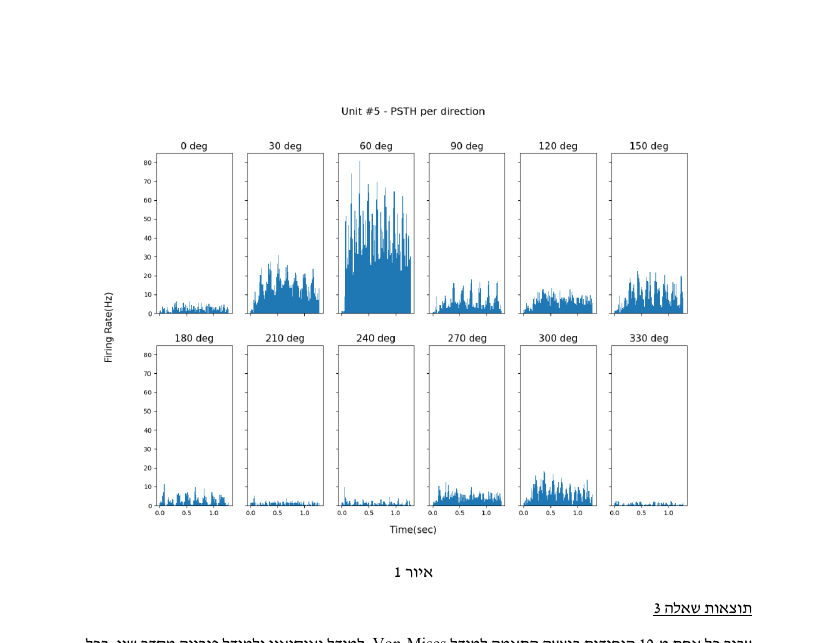
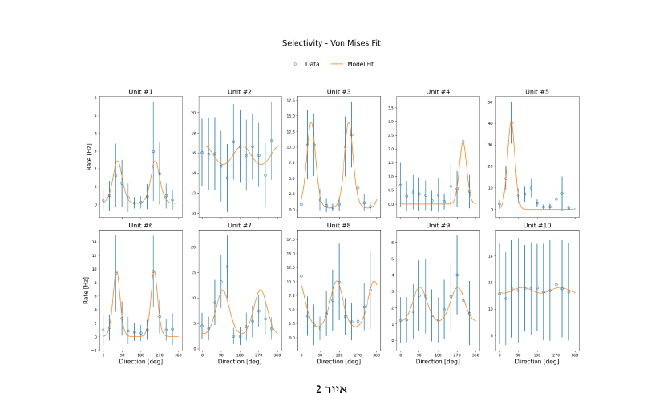
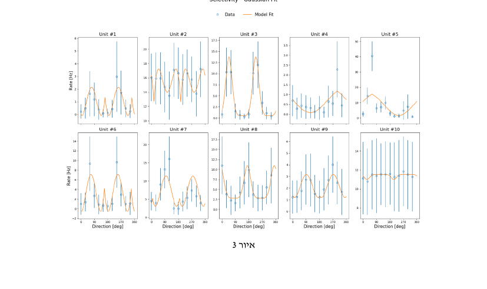
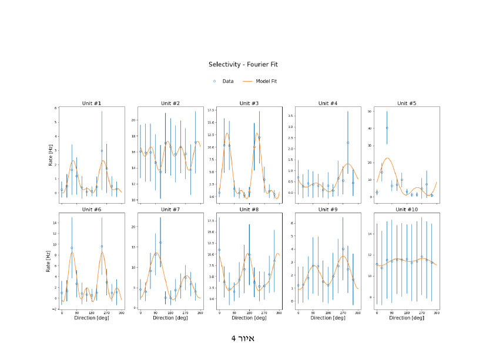

# V1 Orientation & Direction Selectivity Analysis

Analysis of orientation and direction tuning in primary visual cortex (V1) neurons,
using extracellular recordings from a 10×10 electrode array implanted in a monkey's
V1. Built for a Neural Data Analysis course assignment.

10 simultaneously recorded units were shown moving oriented gratings drifting in 12
directions (0°–330°, spaced 30° apart), 200 repetitions per direction. This project
computes firing-rate statistics, peristimulus time histograms (PSTHs), fits tuning
curves to each unit's directional response, and runs statistical tests on tuning
strength and direction selectivity.

## What's here

- **Firing-rate statistics** — mean, median, and standard deviation of firing rate
  across repetitions for a given unit/direction.
- **PSTHs** — spike histograms per direction, per unit, computed with vectorized
  `numpy` operations (no explicit loops over trials).
- **Tuning curve fitting** — each unit's mean response across directions is fit with
  three different models, using `scipy.optimize.curve_fit`:
  - **Von Mises** (circular exponential) — direction- and orientation-selective forms
  - **Wrapped Gaussian** — two-peaked variant for orientation selectivity
  - **Truncated Fourier series** (2 harmonics) — a flexible custom alternative
  
  For each unit, whichever of the direction/orientation forms fits best (lower RMSE)
  is kept and plotted.
- **Statistical analysis**:
  - Pearson correlation between each unit's mean firing rate and its variability
    across directions.
  - Paired t-test comparing firing rates between two opposite stimulus directions
    for a single unit.

## Results

**PSTH — Unit #5, all 12 directions** (this unit shows strong direction selectivity,
firing much more for 30°–60° gratings):



**Tuning curve fits across all 10 units**, Von Mises model:



Von Mises came out as the best-fitting model overall, compared against a wrapped
Gaussian and a custom truncated-Fourier-series model:

| Model      | Average RMSE |
|------------|:---:|
| **Von Mises** | **1.171** |
| Fourier (2 harmonics, bonus) | 1.348 |
| Gaussian | 1.623 |

<details>
<summary>Gaussian and Fourier fits (click to expand)</summary>




</details>

Correlation and t-test results (Q4) are summarized below.

**Statistical results:**
- Pearson correlation between mean firing rate and variability across directions was
  strong and significant for most units (e.g. r = 0.995, p < 0.001 for one unit),
  suggesting more strongly-tuned units also show more variable responses.
- A paired t-test comparing firing rates at two opposite directions (60° vs 240°) for
  the most direction-selective unit showed a statistically significant difference
  (p < 0.05), confirming clear direction selectivity.

## Repo structure

```
├── src/
│   ├── main.py          # full analysis pipeline
│   └── args_parser.py   # CLI args (bin count, unit/direction/repetition counts)
├── data/
│   └── README.md        # where to place the data file (not included, see below)
├── figures/              # figures used in this README
└── requirements.txt
```

## Running it

```bash
pip install -r requirements.txt
cd src
python main.py
```

Optional CLI arguments (see `args_parser.py`):

| Flag | Default | Description |
|---|---|---|
| `--n_units` | 10 | Number of recorded units |
| `--n_directions` | 12 | Number of stimulus directions |
| `--n_repetitions` | 200 | Repetitions per direction |
| `--n_bins` | 64 | Number of PSTH time bins |

The data file (`data/SpikesX10U12D.npy`) is included in this repo — see
[`data/README.md`](data/README.md) for details.

## Notes

- This was a group assignment, done together with three teammates.
- All array operations (spike counting, histogramming, tuning curve evaluation) are
  vectorized rather than looped, per the assignment's requirements.
